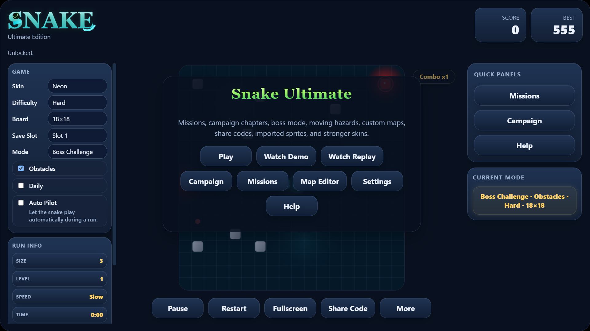
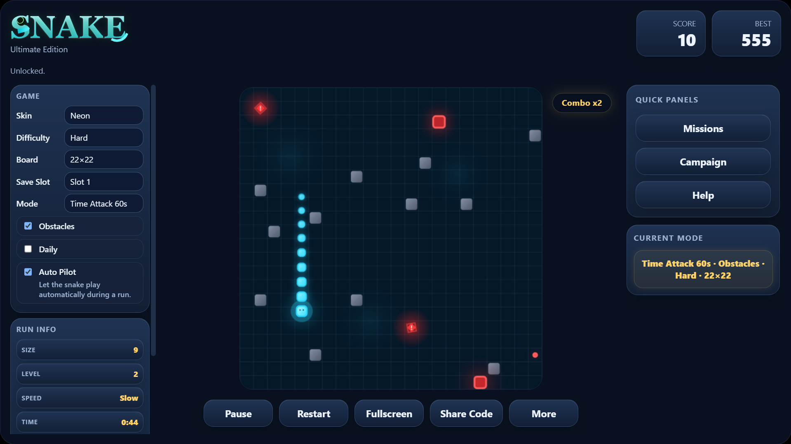
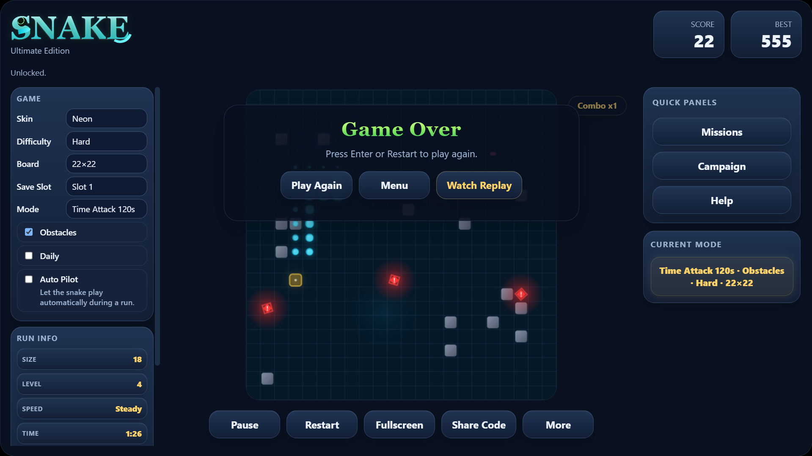
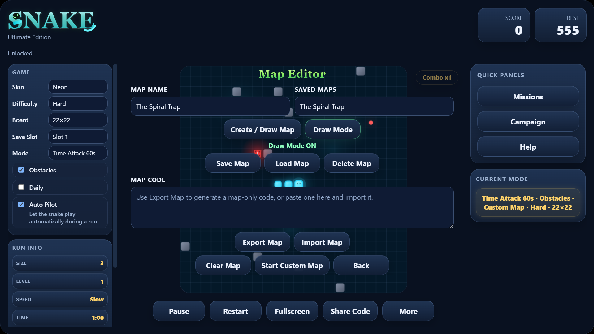

# Snake Ultimate — Advanced Web-Based Snake Game

**Snake Ultimate** is a polished browser-based Snake game built with **HTML5 Canvas, CSS, and vanilla JavaScript**.

What started as a classic Snake game has been expanded into a full arcade-style project featuring multiple game modes, AI Demo mode, replay playback, custom map editing, achievements, missions, campaign progression, local save data, and a premium desktop UI.

> This project is designed as a portfolio-level JavaScript game that demonstrates game-loop architecture, Canvas rendering, state management, replay systems, UI design, and localStorage persistence.

---

## Live Demo

Add your live demo link here:

```txt
https://your-live-demo-link.com
```

---

## Preview






---

## Highlights
- Advanced Snake gameplay built with HTML5 Canvas
- Multiple game modes including Classic, Survival, Time Attack, Multiplayer, and Boss Challenge
- AI Demo / Auto Pilot system
- Gameplay replay system using recorded game-state snapshots
- Custom Map Editor with save/load/export/import support
- Missions, achievements, campaign chapters, and unlockable skins
- Local leaderboard and save-slot system
- Premium desktop-first UI with animated panels and polished visual feedback
- Experimental mobile support

## Game Modes

### Classic Mode
The traditional Snake experience with modern visuals, scoring, obstacles, food types, and difficulty scaling.

### Survival Mode
A pressure-based mode where survival time affects difficulty and bonus score.

### Time Attack Mode
Race against the clock in:
- Time Attack 60s
- Time Attack 120s

### Multiplayer Mode
Two-player local multiplayer:
- Player 1 uses WASD
- Player 2 uses Arrow Keys

### Boss Challenge
A boss-focused mode with boss movement, attack patterns, warning visuals, and challenge-based gameplay.

### Campaign Mode
Chapter-based progression with increasing difficulty and special objectives.

---

## AI Demo / Tutorial Mode
Snake Ultimate includes an AI-powered demonstration mode designed to help visitors understand the game before playing.

The demo system can:
- Auto-play the snake
- Demonstrate movement
- Show food collection
- Avoid danger
- Display rotating tutorial tips

This makes the game more understandable for first-time visitors and improves the project’s presentation value.
