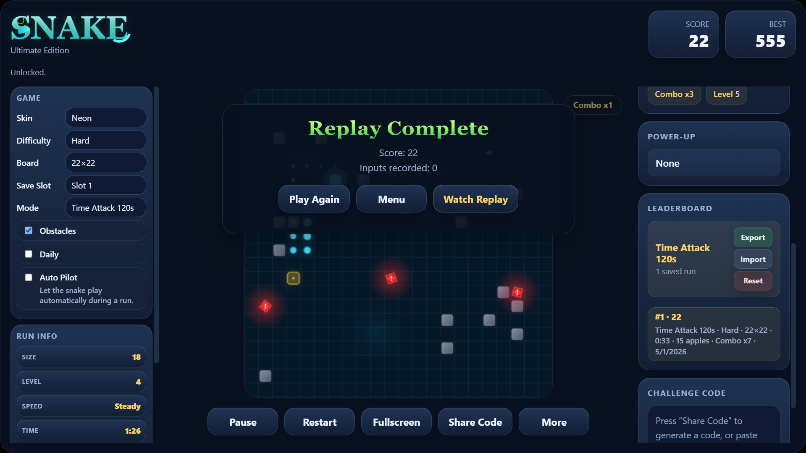

# Snake Ultimate — Advanced Web-Based Snake Game

**Snake Ultimate** is an advanced browser-based Snake game built with **HTML5 Canvas, CSS, and vanilla JavaScript**.

Snake Ultimate expands the classic Snake concept into a desktop-focused arcade game with multiple modes, AI-assisted demo playback, a replay system, custom map editing, achievements, missions, and local save data.

> This project demonstrates Canvas rendering, game-loop architecture, state management, replay playback, localStorage persistence, and UI design using plain JavaScript.

---

## Live Demo

```txt
https://amberm1286-cyber.github.io/Snake-Ultimate/
```

---

## Preview

### Main Menu


### Gameplay


### Map Editor


### Replay System


### Leaderboard


---

## Highlights
- Advanced Snake gameplay built with HTML5 Canvas
- Multiple game modes including Classic, Survival, Time Attack, Multiplayer, and Boss Challenge
- AI Demo / Auto Pilot system
- Gameplay replay system using recorded game-state snapshots
- Custom Map Editor with save/load/export/import support
- Missions, achievements, campaign chapters, and unlockable skins
- Local leaderboard and save-slot system
- Premium desktop-first UI with animated panels and polished visual feedback
- Experimental mobile support

## Game Modes

### Classic Mode
The traditional Snake experience with modern visuals, scoring, obstacles, food types, and difficulty scaling.

### Survival Mode
A pressure-based mode where survival time affects difficulty and bonus score.

### Time Attack Mode
#### Race against the clock in:
- Time Attack 60s
- Time Attack 120s

### Multiplayer Mode
#### Two-player local multiplayer:
- Player 1 uses WASD
- Player 2 uses Arrow Keys

### Boss Challenge
A boss-focused mode with boss movement, attack patterns, warning visuals, and challenge-based gameplay.

### Campaign Mode
Chapter-based progression with increasing difficulty and special objectives.

---

## AI Demo / Tutorial Mode
Snake Ultimate includes an AI-powered demonstration mode designed to help visitors understand the game before playing.

#### The demo system can:
- Auto-play the snake
- Demonstrate movement
- Show food collection
- Avoid danger
- Display rotating tutorial tips

This makes the game more understandable for first-time visitors and improves the project’s presentation value.

---

## Replay System
The replay system records supported gameplay runs and allows the player to watch them again later.

#### Replay support currently includes:
- Classic Mode
- Time Attack 60s
- Time Attack 120s

### The replay system uses two layers:

#### 1. Input Recording

Direction changes are saved with timestamps.

#### 2. Game-State Snapshots

The game also saves state frames during the run, making replay playback stable even when random food, hazards, or timing are involved.

This makes the replay system more reliable than a simple input-only replay system.

---

## Map Editor

The built-in Map Editor allows players to create custom obstacle layouts.

#### Map Editor features:

- Draw custom wall layouts
- Erase placed cells
- Save custom maps
- Load saved maps
- Delete maps
- Export map codes
- Import map codes
- Start custom-map runs

---

## Progression Systems

#### Snake Ultimate includes several progression features:

- Achievements
- Missions
- Campaign chapters
- Unlockable skins
- Local leaderboard
- Save slots
- Best score tracking

All progress is stored locally using `localStorage`.

---

## UI / UX Features

#### The game includes a premium dark arcade-style interface with:

- Animated buttons
- Game Over popup
- Combo badge
- Run information panel
- Score and best-score cards
- Mission and campaign panels
- Drawer-style extra tools
- Responsive experiments for mobile devices

The current version is primarily optimized for desktop gameplay.

---

## Tech Stack
- HTML5
- CSS3
- JavaScript
- HTML5 Canvas
- LocalStorage
- Modular JavaScript architecture

No external game engine was used.

---

## Project Structure

```txt
Snake-Ultimate/
├── index.html
├── styles.css
├── main.js
├── snake-logic.js
├── screenshots/
│   ├── menu.png
│   ├── gameplay.png
│   ├── map-editor.png
│   ├── replay.png
    └── leaderboard.png
└── README.md
```

---

## Architecture Overview

The project is organized into separate files for clarity and maintainability.

### `index.html`

Contains the game layout, panels, overlays, buttons, menu screens, settings UI, and Canvas element.

### `styles.css`

Handles the full visual design, including layout, animations, buttons, panels, overlays, desktop UI, and experimental mobile styling.

### `snake-logic.js`

#### Contains reusable core game logic such as:

- Snake movement rules
- Direction validation
- Food placement
- Collision detection
- Obstacle generation
- Hazard logic
- Board state creation

### `main.js`

#### Controls the main application layer, including:

- Game loop
- Canvas rendering
- UI events
- Game modes
- Replay recording and playback
- Achievements
- Missions
- Campaign logic
- Leaderboard
- LocalStorage
- AI Demo / Auto Pilot
- Map Editor connection

---

## Controls

### Single Player

#### Use: 
```txt
Arrows Keys
```
#### or:
```txt
WASD
```

### Multiplayer 

```txt
Player 1: WASD
Player 2: Arrow Keys
```

---

## Local Storage

#### Snake Ultimate uses `localStorage` for:

- Best scores
- Save slots
- Settings
- Missions
- Achievements
- Leaderboard
- Custom maps
- Last replay

This allows progress to remain saved in the browser without a backend.

---

## How to Run Locally

### Option 1: Open directly

#### Open:
```txt
index.html
```
in your browser.

### Option 2: Run with a local server

#### From the project folder:
```bash
python -m http.server 5500
```

#### Then open:
```txt
http://localhost:5500
```

---

## Key Engineering Concepts Used

#### This project demonstrates:

- Canvas-based rendering
- Game loop architecture
- Collision detection
- State management
- Input handling
- Local persistence
- Modular JavaScript
- Replay system design
- UI state synchronization
- Responsive UI experimentation
- Debugging and large-file maintenance

---

## Roadmap / Future Improvements

#### Planned improvements:

- Fully redesigned mobile-first version
- Sound effects and audio settings
- Multiple saved replays
- Replay export/import codes
- More boss attack patterns
- More campaign chapters
- Online leaderboard
- Better accessibility options
- More themes and visual effects
- Cleaner file splitting for long-term maintainability

---

## Current Status

Desktop version: Stable and portfolio-ready
Mobile version: Experimental support added
Replay system: Classic and Time Attack supported
AI Demo: Complete
Map Editor: Complete

---

## What This Project Demonstrates

This project demonstrates practical JavaScript game development concepts including Canvas rendering, game-loop design, collision detection, state management, localStorage persistence, UI state synchronization, and replay playback.

---

## Author

Built by Amber Mahajan

